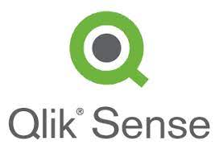
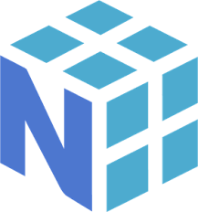
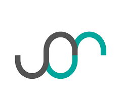
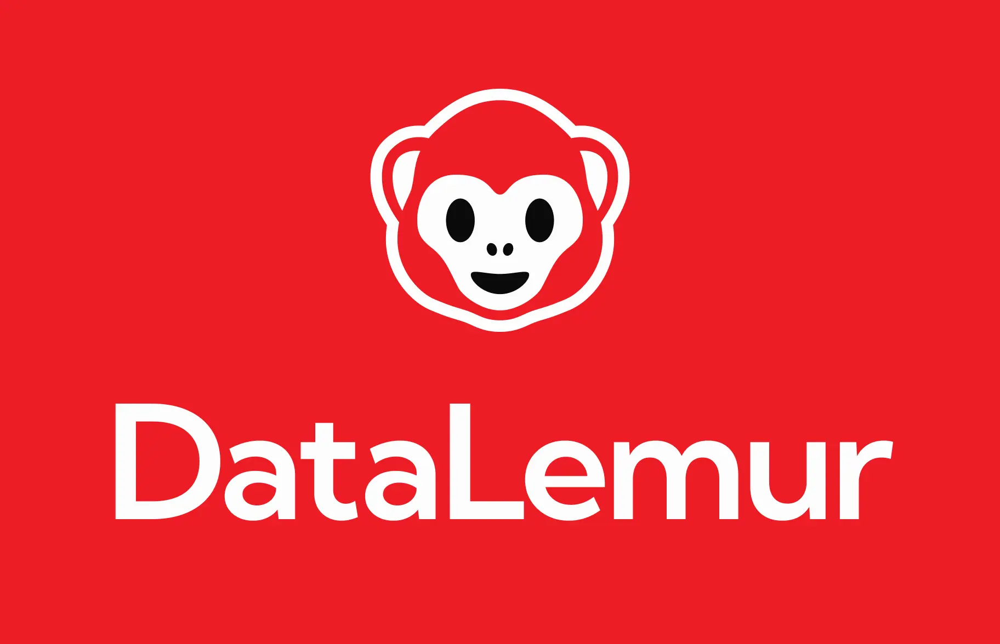
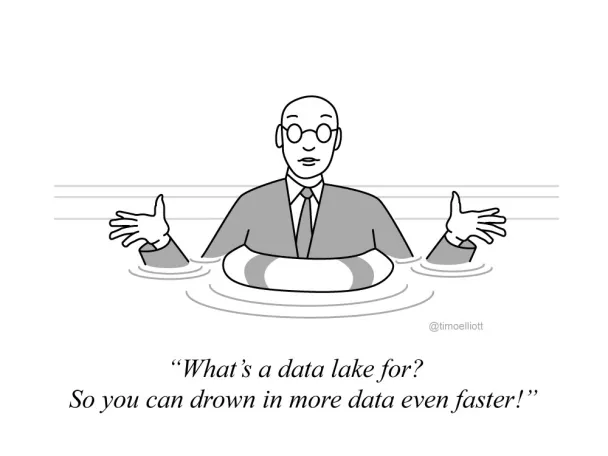

<h1 align="center">
    <!--  -->
    
</h1>

<h4 align="center" >“Data are just summaries of thousands of stories—tell a few of those stories to help make the data meaningful.”~ Dan Heath.</h4>

 
 

 

📊 Crafting stories from data chaos. As a seasoned Data Enthusiast, I bring raw numbers to life, turning them into captivating narratives. Embracing Dan Heath's wisdom, I believe that data are not just summaries but a collection of stories waiting to be told. 💻✨
 

 

 
  
  
  <a href="https://sirrikademani.github.io/Portfolio/" target="_blank">
      <!-- sqlite, safari, google-chrome are other good icon options -->
  </a>
  <a href="https://public.tableau.com/app/profile/sirri19/vizzes" target="_blank">
      <!-- sqlite, safari, google-chrome are other good icon options -->
  </a>

 

 

🌱 Proficient in **SQL, Python, Alteryx, Snowflake, Alation, JIRA, Microsoft Office, Tableau, Qlik Sense, and Power BI.** I have a strong foundation in enterprise analytics, marketing analytics, and business process analytics.

❤️ Passionate about crafting insightful dashboards that drive data-driven decision-making. 

💬 Certified in **Tableau Desktop and Snowflake (SnowPro Core)**, with a proven track record of automating tasks and optimizing data processes.

⚡ Fun fact: I blend creativity with wellness in my life – from crafting Mandala and Acrylic art to maintaining an active running routine and mastering vegetarian cooking.

 

  <h2>⚙️ Technologies & Tools ⚙️</h2>
   
  
  
  
  
  
  
  
  
  
  
  
  
  
  
  
  
  
  
   

 

    <h2 style="background-color: #f2f2f2;">🚀 Project Portfolio 🚀 </h2>

### 🔭 Python/Data Science Projects 
| Project | Description| 
| --- | --- | 
| [Marketing Data Analysis for Caravana](https://github.com/sirrikademani/Marketing-Data-Analysis-for-Caravana) |   Analyze Caravana's marketing data, focusing on user click behavior and attribution to marketing channels. Understand the relative performance of each channel. |
| [Topic Modeling Using NLP](https://github.com/sirrikademani/Topic-Modeling-Using-NLP) |   Proposed Zomato’s US entry strategy using Reddit data analysis. Used NLP techniques like LDA for topic modeling to uncover insights like delivery speed and customer service. |
| [Axons Customer Review Category Prediction](https://github.com/sirrikademani/Axons-Customer-Review-Category-prediction) |   Built binary classifier for review categorization using NLP. Automated manual sorting and presented data insights via Tableau dashboards. |
| [Santander Customer Satisfaction Prediction](https://github.com/sirrikademani/Santander-Customer-Satisfaction-Prediction) |   Used decision trees on 76K+ data points to predict customer satisfaction. Performed extensive exploratory data analysis. |
| [Parking Lot Space Picker Using Computer Vision](https://github.com/sirrikademani/ParkingLot-Space-Picker-Using-ComputerVision) |   Developed a computer vision model to detect and count available parking spaces in real-time. |

### 🔭 Data Analysis and Visualization Projects 
| Project | Description|
| --- | --- |
| [Winter Storm Damage Insurance Portfolio Analysis](https://github.com/sirrikademani/Winter-Storm-Damage-Insurance-portfolio-analysis-using-Power-BI) |  Performing Portfolio Analysis due to winter storm damage for a client insurance company using descriptive and predictive analytics to understand the vulnerability due to various factors and plotting correlation to fetch insights. |
| [Tableau Dashboard Workbooks](https://github.com/sirrikademani/Tableau-Dashboards) | Presenting some of my Tableau work here, you can also visit my Tableau Public to see some of the dashboards built-> https://public.tableau.com/app/profile/sirri19 | 

    <h2 style="background-color: #f2f2f2;">💻 Social Media Profiles 💻</h2>

| Coding Profile | Social Media |
| --- | --- | 
|Hacker Rank   |LinkedIn   |
|Strata scratch    |Portfolio Website  |
|Leet Code  |Art Account   |  
|Data Lemur   |Tableau Public   |  
|Code Wars   |  | 

              

  <h2>🎖️ My Contributions 📝 </h2>
   
  
  
     

<h2 align="center">⚡ Stats ⚡</h2>
 

  
  
   
  

  

 

