<h1 align="center">
    
</h1>

    <h4>"Data are just summaries of thousands of stories—tell a few of those stories to help make the data meaningful." ~ Dan Heath</h4>
    

---

## 👋 About Me

📊 **Data Enthusiast & Analytics Professional**

I'm a seasoned data professional passionate about transforming raw data into compelling narratives. With expertise spanning enterprise analytics, machine learning, and business intelligence, I craft data-driven solutions that drive meaningful insights and innovation.

### 🌟 Key Highlights

- 🎯 Certified in **Tableau Desktop** and **Snowflake (SnowPro Core)**
- 🔧 Proficient in **SQL, Python, Alteryx, Snowflake, Tableau, Power BI, Qlik Sense**
- 🤖 Focused on **ML interpretability** and **ethical AI** implications
- 🎨 Creative blend of **Mandala/Acrylic art**, **active running**, and **vegetarian cooking**
- 🚀 Actively contributing to **open-source ML projects** and fostering **community engagement**

---

## 🛠️ Tech Stack

  

    
    
    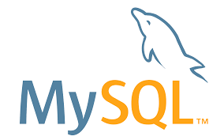
    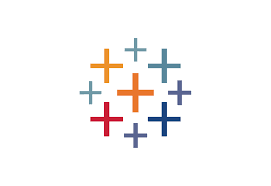
    
    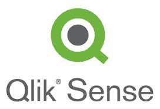
    
    
  

  

    
    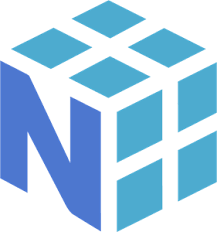
    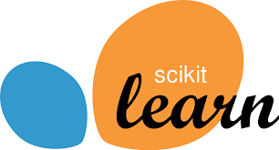
    
    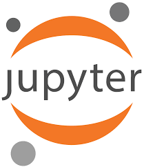
    
    
    
  

---

## 🎖️ Achievements & Certifications

    
    

---

## 🚀 Project Portfolio

### 📊 Python & Data Science Projects

| Project | Description |
|---------|-------------|
| [Marketing Data Analysis for Caravana](https://github.com/sirrikademani/Marketing-Data-Analysis-for-Caravana) |  Comprehensive analysis of marketing data for data-driven decision making |
| [Topic Modeling Using NLP](https://github.com/sirrikademani/Topic-Modeling-Using-NLP) | 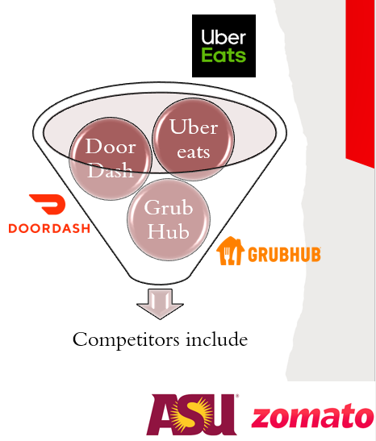 NLP-based topic extraction and analysis |
| [Axons Customer Review Classification](https://github.com/sirrikademani/Axons-Customer-Review-Category-prediction) | 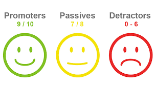 ML model for automatic review categorization |
| [Santander Customer Satisfaction Prediction](https://github.com/sirrikademani/Santander-Customer-Satisfaction-Prediction) |  Predictive model for customer satisfaction forecasting |
| [Parking Lot Space Detection](https://github.com/sirrikademani/ParkingLot-Space-Picker-Using-ComputerVision) | 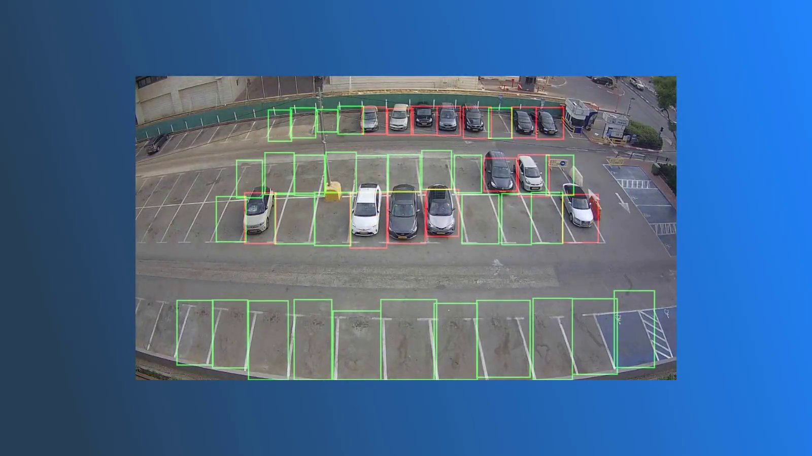 Computer vision solution for parking space detection |

### 📈 Data Analysis & Visualization Projects

| Project | Description |
|---------|-------------|
| [Winter Storm Insurance Portfolio Analysis](https://github.com/sirrikademani/Winter-Storm-Damage-Insurance-portfolio-analysis-using-Power-BI) |  Power BI dashboard for insurance portfolio risk analysis |
| [Tableau Dashboard Collection](https://github.com/sirrikademani/Tableau-Dashboards) | 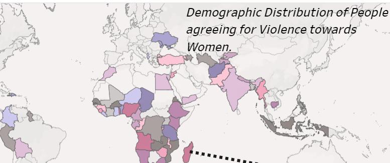 Curated collection of interactive Tableau visualizations |

---

## 📫 Connect With Me

    
    
    
    

---

## 🧠 Coding Profiles & Social Media

| Coding Profiles | Social Media |
|---|---|
| [🏆 HackerRank](https://www.hackerrank.com/profile/skademan) | [💼 LinkedIn](https://www.linkedin.com/in/sirimk/) |
| [🟡 LeetCode](https://leetcode.com/u/Siri19/) | [📷 Instagram Art](https://instagram.com/) |
| [⚔️ CodeWars](https://www.codewars.com/users/Sirrikademani) | [📊 Tableau Public](https://public.tableau.com/app/profile/sirri19/vizzes) |
| [📊 Strata Scratch](https://platform.stratascratch.com/user/siri.kademani19) | |
| [💾 DataLemur](https://datalemur.com/profile) | |

---

## 📊 GitHub Analytics

  
  
  

 

  

  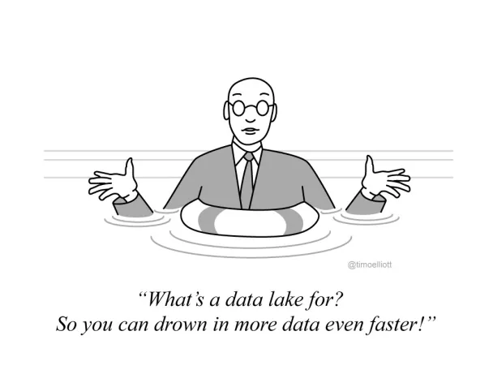
  
    
  
  <b>⭐ If you find my work interesting, feel free to star repos and reach out!</b>

